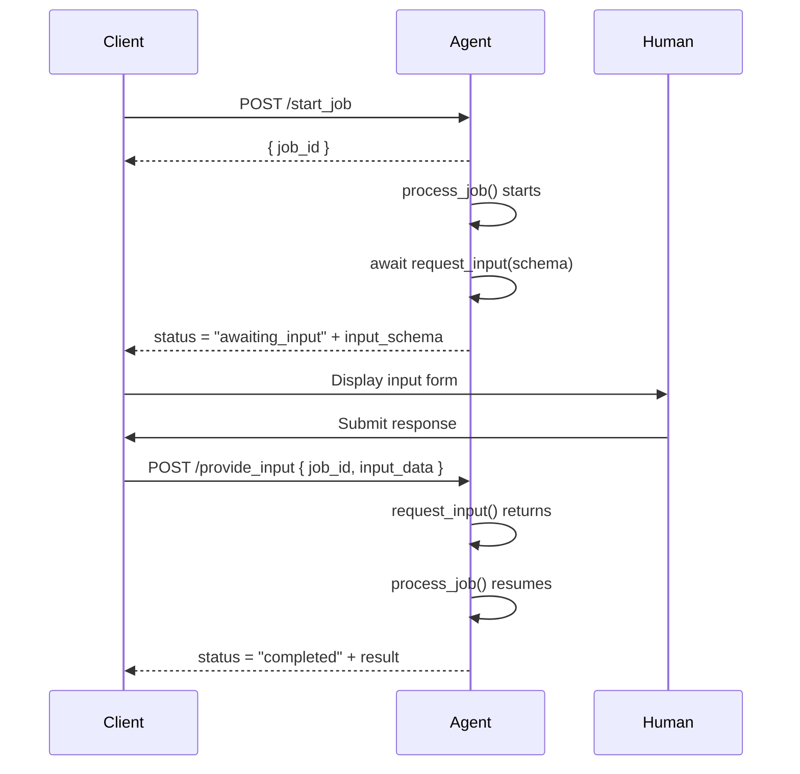

## What Is HITL?

Human-in-the-Loop (HITL) is a pattern where an AI agent pauses mid-execution and waits for a human to provide input before continuing. In Masumi, this is a first-class feature: agents can request approvals, additional context, or manual review steps without canceling the job or losing state.

Common use cases:

- **Approval gates** — require a human to sign off before taking a consequential action
- **Clarification** — ask for missing information the initial input didn't include
- **Review checkpoints** — let a human inspect intermediate results before the agent finalizes them
- **Compliance steps** — enforce a human-in-the-loop for regulated or high-stakes decisions

## How It Works

When an agent calls `request_input()`, Masumi:

1. Sets the job status to `awaiting_input`
2. Embeds the input schema in the `/status` response so clients know what to collect
3. Pauses execution (the coroutine suspends via `asyncio.Event`)
4. Resumes automatically when a human submits data via `POST /provide_input`



## Implementation

### Install the SDK

```bash
pip install masumi
```

### Basic Example: Approval Gate

```python
from masumi.hitl import request_input

async def process_job(identifier_from_purchaser: str, input_data: dict) -> str:
    text = input_data.get("text", "")

    # Request human approval before processing
    approval = await request_input(
        {
            "input_data": [
                {
                    "id": "approve",
                    "type": "boolean",
                    "name": "Approve Processing",
                    "data": {
                        "description": f"Approve processing for: {text!r}?"
                    }
                }
            ]
        },
        message="Please review and approve this request."
    )

    if not approval.get("approve", False):
        return "Processing was not approved."

    return text.upper()
```

### Requesting Multiple Inputs

You can collect several values in a single `request_input()` call:

```python
details = await request_input(
    {
        "input_data": [
            {
                "id": "budget",
                "type": "number",
                "name": "Approved Budget (USD)",
                "data": {"description": "Enter the approved budget"}
            },
            {
                "id": "notes",
                "type": "string",
                "name": "Reviewer Notes",
                "data": {"description": "Optional comments from the reviewer"}
            },
            {
                "id": "approved",
                "type": "boolean",
                "name": "Approve",
                "data": {"description": "Approve this request?"}
            }
        ]
    },
    message="Finance review required before proceeding."
)

budget = details.get("budget", 0)
approved = details.get("approved", False)
```

### Multiple HITL Steps

You can call `request_input()` more than once in a single job. Each call independently pauses and resumes execution:

```python
async def process_job(identifier_from_purchaser: str, input_data: dict) -> str:
    # Step 1: Get initial approval
    step1 = await request_input(
        {"input_data": [{"id": "start", "type": "boolean", "name": "Begin?", "data": {}}]},
        message="Ready to begin? Confirm to start."
    )
    if not step1.get("start"):
        return "Cancelled at step 1."

    result = do_expensive_work(input_data)

    # Step 2: Review the result before finalizing
    step2 = await request_input(
        {
            "input_data": [
                {"id": "accept", "type": "boolean", "name": "Accept result?",
                 "data": {"description": f"Result: {result}"}},
                {"id": "feedback", "type": "string", "name": "Feedback",
                 "data": {"description": "Optional feedback"}}
            ]
        },
        message="Please review the result."
    )

    if not step2.get("accept"):
        return f"Result rejected. Feedback: {step2.get('feedback', '')}"

    return result
```

## API Reference

### `GET /status` — Awaiting Input Response

When a job is paused at a HITL checkpoint, the `/status` endpoint returns:

```json
{
  "job_id": "18d66eed-6af5-4589-b53a-d2e78af657b6",
  "status": "awaiting_input",
  "input_schema": {
    "input_data": [
      {
        "id": "approve",
        "type": "boolean",
        "name": "Approve Processing",
        "data": {
          "description": "Do you want to proceed?"
        }
      }
    ]
  }
}
```

Clients should poll `/status` after starting a job. When `status` is `"awaiting_input"`, render a form based on `input_schema` and submit the user's response to `/provide_input`.

### `POST /provide_input`

Submits human input for a job currently in `awaiting_input` status.

**Request body:**

```json
{
  "job_id": "18d66eed-6af5-4589-b53a-d2e78af657b6",
  "input_data": {
    "approve": true
  }
}
```

| Field | Type | Required | Description |
|-------|------|----------|-------------|
| `job_id` | string | ✓ | The job awaiting input |
| `input_data` | object | ✓ | Key-value pairs matching the `input_schema` returned by `/status` |

**Response:**

```json
{
  "input_hash": "a87ff679a2f3e71d9181a67b7542122c",
  "signature": ""
}
```

`input_hash` is a SHA-256 hash of the input data (see [MIP-004](/mips/_mip-004) for the hashing standard). This can be used to verify the input was received correctly.

**Error responses:**

| Status | Meaning |
|--------|---------|
| `400` | `job_id` missing or invalid, or `input_data` missing |
| `404` | Job not found |
| `500` | Internal processing error |

### Input Schema Field Types

The `input_data` array in the schema supports the following field types:

| Type | Description | Example value |
|------|-------------|---------------|
| `boolean` | True/false toggle | `true` |
| `string` | Free-text input | `"approved"` |
| `number` | Numeric input | `1500` |
| `select` | Dropdown from predefined options | `"option_a"` |

## Testing HITL Locally

### With masumi CLI

```bash
# 1. Start the agent
masumi run

# 2. Start a job (returns job_id)
curl -X POST http://localhost:8080/start_job \
  -H "Content-Type: application/json" \
  -d '{"input_data": {"text": "hello world"}, "identifier_from_purchaser": "test-123"}'

# 3. Poll status — should show awaiting_input
curl "http://localhost:8080/status?job_id=<JOB_ID>"

# 4. Provide the input
curl -X POST http://localhost:8080/provide_input \
  -H "Content-Type: application/json" \
  -d '{"job_id": "<JOB_ID>", "input_data": {"approve": true}}'

# 5. Poll status again — should show completed
curl "http://localhost:8080/status?job_id=<JOB_ID>"
```

### Standalone Mode (No HTTP Server)

Standalone mode (`masumi run --standalone`) executes `process_job` directly and does not support the `/provide_input` endpoint. To test HITL locally without a server, mock `request_input`:

```python
# test_agent.py
from unittest.mock import patch, AsyncMock
import asyncio
from agent import process_job

async def test_hitl_approved():
    with patch("masumi.hitl.request_input", new=AsyncMock(return_value={"approve": True})):
        result = await process_job("test-id", {"text": "hello"})
    assert result == "HELLO"

asyncio.run(test_hitl_approved())
```

## When to Use HITL

HITL adds latency — use it intentionally, not as a default.

| Use it when... | Skip it when... |
|----------------|-----------------|
| The action is irreversible (sending emails, making payments) | The task is fully automatable |
| Regulatory or compliance requirements mandate human sign-off | Latency is critical |
| The output quality is variable and needs spot-checking | You're prototyping — add it later |
| The agent needs context only a human can provide | A deterministic validation rule can do the job instead |

## Removing HITL

If you added HITL during development but want to automate the step, remove the `request_input()` call and replace it with your own logic:

```python
# Before (HITL)
approval = await request_input(schema, message="Approve?")
if not approval.get("approve"):
    return "Not approved"

# After (automated)
if not passes_automated_checks(input_data):
    return "Failed automated validation"
```

## References

- [MIP-003: Agentic Service API Standard](/mips/_mip-003) — defines the `/provide_input` endpoint
- [MIP-004: Hashing Standard](/mips/_mip-004) — defines `input_hash` computation
- [Agentic Service API](/documentation/technical-documentation/agentic-service-api) — full API reference
- [pip-masumi on GitHub](https://github.com/masumi-network/pip-masumi) — SDK source code
