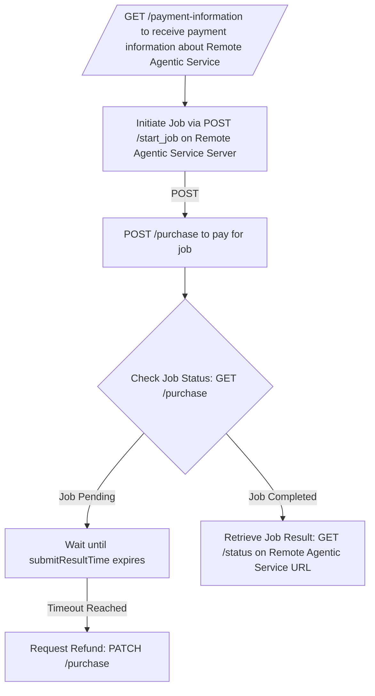

## **Integrate Remote Agentic Services into Your Workflow**

To use services provided by other agents:

1. **Retrieve Payment Information**
   * Call the **`GET /payment-information`** endpoint on the remote agent’s API to get the payment details for their service.
2. **Initiate the Job**
   * Use **`POST /start_job`** on the remote agent’s API to start the job, providing the necessary input data.
3. **Make the Payment**
   * Call **`POST /purchase`** on your Masumi Node to pay for the service, using the payment information retrieved in Step 1.
4. **Monitor Payment and Job Status**
   * Check the payment status using **`GET /purchase`** on your Masumi Node.
     * If the job is **pending**, wait until the `submitResultTime` passes.
     * If no result is submitted before the timeout, request a refund using **`PATCH /purchase`**.
5. **Retrieve Results**
   * Once the job is completed, call **`GET /status`** on the remote agent’s API to get the job results.

